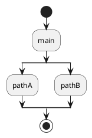

# Architecture Documentation

This document provides an overview of the Call Stack to PlantUML extension's architecture, design decisions, and implementation details.

## 📐 Overview

The extension captures call stacks from VS Code debug sessions and converts them into PlantUML Activity Diagrams. It maintains a tree structure to support recording multiple execution paths and intelligently merges overlapping call stacks.

## 🏗️ High-Level Architecture

```
┌────────────────────────────────────────────────────────────┐
│                      VS Code Extension Host                │
│                                                            │
│  ┌──────────────────────────────────────────────────────┐  │
│  │          Extension Activation & Commands             │  │
│  │                                                      │  │
│  │  • extension.recordCallStack                         │  │
│  │  • extension.copyCallStackToPlantUML                 │  │
│  │  • extension.resetCallStackTree                      │  │
│  └────────────────┬─────────────────────────────────────┘  │
│                   │                                        │
│  ┌────────────────▼─────────────────────────────────────┐  │
│  │         Call Stack Management Layer                  │  │
│  │                                                      │  │
│  │  • StackFrameNode (Tree Structure)                   │  │
│  │  • recordCallStackInfo()                             │  │
│  │  • findNodeInChildren()                              │  │
│  │  • areFramesEqual()                                  │  │
│  └────────────────┬─────────────────────────────────────┘  │
│                   │                                        │
│  ┌────────────────▼─────────────────────────────────────┐  │
│  │        PlantUML Generation Layer                     │  │
│  │                                                      │  │
│  │  • callStackToPlantUML()                             │  │
│  │  • autoWordWrap2()                                   │  │
│  │  • getRelativePath()                                 │  │
│  └────────────────┬─────────────────────────────────────┘  │
│                   │                                        │
└───────────────────┼────────────────────────────────────────┘
                    │
         ┌──────────┴──────────┐
         │                     │
    ┌────▼────┐          ┌────▼────┐
    │  Debug  │          │ System  │
    │ Adapter │          │Clipboard│
    │Protocol │          └─────────┘
    └─────────┘
```

## 🔧 Core Components

### 1. Extension Lifecycle

#### `activate(context: vscode.ExtensionContext)`

**Purpose**: Initialize the extension and register commands.

**Responsibilities**:

- Create the root node of the call stack tree
- Register three commands with VS Code
- Set up debug session event listeners
- Add disposables to the extension context

**State Management**:

```typescript
const rootStackFrameNode = new StackFrameNode({
  id: -1,
  name: "Root",
} as DebugProtocol.StackFrame);
```

The root node persists across multiple command invocations, allowing accumulation of call stacks.

#### `deactivate()`

**Purpose**: Clean up when the extension is deactivated.

**Current Implementation**: No-op (VS Code handles disposal automatically)

### 2. Data Model

#### `StackFrameNode` Class

**Purpose**: Represents a node in the call stack tree.

```typescript
class StackFrameNode {
  frame: DebugProtocol.StackFrame;  // Stack frame data from DAP
  children: StackFrameNode[];        // Nested function calls
}
```

**Design Rationale**:

- **Tree structure** allows representing multiple execution paths
- **Children array** supports branching (e.g., if/else paths)
- **Mutable children** enables incremental tree building

**Example Tree Structure**:

```
Root
├── main()
│   ├── processA()
│   │   └── helperA()
│   └── processB()
│       └── helperB()
```

### 3. Call Stack Capture

#### `recordCallStackInfo(session, treeRootNode)`

**Purpose**: Capture call stack from debug session and merge into tree.

**Algorithm**:

1. **Thread Selection**:

   ```typescript
   const threadsResponse = await session.customRequest("threads");
   const selectedThread = await vscode.window.showQuickPick(...);
   ```

   - Retrieves all threads from debugger
   - Presents user with selection UI
   - Returns early if no selection made

2. **Stack Trace Retrieval**:

   ```typescript
   const stackTraceResponse = await session.customRequest("stackTrace", {
     threadId,
   });
   ```

   - Fetches stack frames for selected thread
   - Reverses array (debugger returns top-to-bottom, we need bottom-to-top)

3. **Overlap Detection**:

   ```typescript
   let currentNode = treeRootNode;
   let overlappedNode = null;
   
   for (const frame of callStack) {
     overlappedNode = findNodeInChildren(currentNode, frame);
     if (overlappedNode) {
       currentNode = overlappedNode;
     } else {
       break;
     }
   }
   ```

   - Finds common prefix between new call stack and existing tree
   - Stops at first non-matching frame

4. **Tree Insertion**:

   ```typescript
   for (const frame of nonOverlappingFrames) {
     const newNode = { frame, children: [] };
     currentNode.children.push(newNode);
     currentNode = newNode;
   }
   ```

   - Appends only non-overlapping frames as new nodes

**Example Merge**:

Initial tree:

```
Root → main() → pathA()
```

New call stack: `main() → pathB()`

Result:

```
Root → main() ─┬→ pathA()
               └→ pathB()
```

#### `findNodeInChildren(node, frame)`

**Purpose**: Recursively search tree for matching frame.

**Algorithm**: Depth-first search with frame equality check.

**Time Complexity**: O(n) where n is number of nodes in tree.

#### `areFramesEqual(frame1, frame2)`

**Purpose**: Compare two frames for equality.

**Comparison Criteria**:

- Function name (`frame.name`)
- Source file path (`frame.source?.path`)
- Line number (`frame.line`)
- Column number (`frame.column`)

**Design Note**: Column comparison might be too strict for some use cases (e.g., minified code).

### 4. PlantUML Generation

#### `callStackToPlantUML(rootStackFrameNode, maxLength)`

**Purpose**: Convert call stack tree to PlantUML Activity Diagram syntax.

**Algorithm**:

1. **Initialization**:

   ```plantuml
   @startuml
   start
   ```

2. **Tree Traversal**:

   ```typescript
   function traverseNode(node: StackFrameNode) {
     for (const [index, child] of node.children.entries()) {
       if (index === 0 && node.children.length > 1) {
         plantUMLScript += "\nsplit\n\n";
       } else if (index > 0) {
         plantUMLScript += "\nsplit again\n\n";
       }
       
       // Add activity
       const wrappedLines = autoWordWrap2(child.frame.name, maxLength);
       plantUMLScript += `:${wrappedLines.join("\n")};\n`;
       
       // Recurse
       traverseNode(child);
     }
     
     if (node.children.length > 1) {
       plantUMLScript += "\nend split\n\n";
     }
   }
   ```

3. **Branching Logic**:
   - Single child: Linear flow
   - Multiple children: Use `split` / `split again` / `end split`

4. **Finalization**:

   ```plantuml
   stop
   @enduml
   ```

**Example Output**:



#### `autoWordWrap2(line, maxLength)`

**Purpose**: Wrap long function names to fit diagram constraints.

**Algorithm**:

1. Split by spaces
2. Build lines that don't exceed `maxLength`
3. Special handling for segments starting with `*` (indentation)

**Design Issues**:

- Doesn't handle words longer than `maxLength`
- Function name suffix `2` suggests iteration without removing `1`

**Improvement Opportunities**:

- Add hyphenation for long words
- Better handling of special characters
- Rename to `wrapText` or similar

### 5. Configuration

#### `getMaxLength()`

**Purpose**: Read user configuration for line wrapping.

**Configuration Key**: `call-stack-to-plantuml.maxLength`

**Default Value**: 60

**Usage Pattern**:

```typescript
const maxLength = getMaxLength();
const plantUML = callStackToPlantUML(rootNode, maxLength);
```

## 🔄 Data Flow

### Recording Call Stack

```
User triggers command
    ↓
Check debug session active
    ↓
Request threads from debugger
    ↓
User selects thread
    ↓
Request stack trace for thread
    ↓
Reverse stack frames (bottom-to-top)
    ↓
Find overlapping prefix in tree
    ↓
Append non-overlapping frames
    ↓
Update tree structure
    ↓
Show confirmation message
```

### Generating PlantUML

```
User triggers command
    ↓
Check debug session active
    ↓
Record call stack (if needed)
    ↓
Get maxLength configuration
    ↓
Traverse tree depth-first
    ↓
For each node:
  - Wrap function name
  - Add PlantUML syntax
  - Handle splits for branches
    ↓
Copy script to clipboard
    ↓
Show confirmation message
```

## 🎯 Design Decisions

### 1. Why Tree Structure?

**Decision**: Use tree instead of flat array or graph.

**Rationale**:

- Naturally represents nested function calls
- Supports multiple execution paths
- Enables efficient overlap detection
- Simplifies PlantUML generation with recursion

**Trade-offs**:

- More memory than flat array
- Requires careful merging logic
- Harder to serialize/deserialize

### 2. Why Activity Diagrams?

**Decision**: Generate Activity Diagrams instead of Sequence Diagrams.

**Rationale**:

- Activity diagrams better show control flow
- Easier to represent branching paths
- More intuitive for developers
- PlantUML syntax is simpler

**Alternative Considered**: Sequence diagrams (better for showing interactions between components)

### 3. Why Mutable State?

**Decision**: Store tree in closure within `activate()`.

**Rationale**:

- Simple implementation
- State persists across command invocations
- No need for global variables
- Automatic cleanup on deactivation

**Trade-offs**:

- Harder to test (state is not injectable)
- Can't easily persist across sessions
- Limited extensibility

**Future Improvement**: Consider stateful class or context-based storage.

### 4. Why Debug Adapter Protocol?

**Decision**: Use DAP for debugger communication.

**Rationale**:

- Standard protocol across all VS Code debuggers
- Well-documented and stable
- Future-proof (debugger-agnostic)
- Type-safe with `vscode-debugprotocol` package

## 🧪 Testing Strategy

### Current State

- Minimal test coverage
- Only sample tests exist
- No integration tests with debuggers

### Recommended Approach

#### Unit Tests

```typescript
suite('Frame Comparison', () => {
  test('areFramesEqual returns true for identical frames', () => {
    const frame1 = { name: 'foo', source: { path: '/a.ts' }, line: 10, column: 5 };
    const frame2 = { name: 'foo', source: { path: '/a.ts' }, line: 10, column: 5 };
    assert.strictEqual(areFramesEqual(frame1, frame2), true);
  });
});
```

#### Integration Tests

```typescript
suite('PlantUML Generation', () => {
  test('generates correct PlantUML for linear call stack', () => {
    const root = createMockTree();
    const plantuml = callStackToPlantUML(root);
    assert.ok(plantuml.includes('@startuml'));
    assert.ok(plantuml.includes('@enduml'));
  });
});
```

## 🚀 Performance Considerations

### Time Complexity

- **recordCallStackInfo**: O(n × m) where n = frames, m = tree size
- **findNodeInChildren**: O(t) where t = tree nodes
- **callStackToPlantUML**: O(t) where t = tree nodes

### Space Complexity

- Tree storage: O(u) where u = unique frames across all recordings
- PlantUML string: O(t × l) where l = average line length

### Optimization Opportunities

1. **Caching**: Cache frame comparisons
2. **Indexing**: Use Map for O(1) frame lookup
3. **Pruning**: Limit tree depth/breadth
4. **Streaming**: Generate PlantUML without building full string

## 🔮 Future Enhancements

### Planned Features

1. **Export Formats**: SVG, PNG, JSON
2. **Frame Filtering**: Hide framework code
3. **Custom Styling**: User-defined PlantUML themes
4. **Persistence**: Save/load call stack trees
5. **Diff View**: Compare execution paths

### Architecture Changes

1. **State Management**: Move to proper state class
2. **Plugin System**: Allow custom exporters
3. **Background Processing**: Handle large call stacks
4. **Caching Layer**: Improve performance

## 📚 Key Files

| File | Purpose | Lines of Code |
|------|---------|---------------|
| `src/extension.ts` | Main extension logic | ~400 |
| `package.json` | Extension manifest | ~60 |
| `tsconfig.json` | TypeScript config | ~15 |

## 🔗 External Dependencies

| Package | Version | Purpose |
|---------|---------|---------|
| `vscode` | `^1.76.0` | VS Code API |
| `vscode-debugprotocol` | `^1.51.0` | Debug Adapter Protocol types |

## 📖 Further Reading

- [VS Code Extension Guidelines](https://code.visualstudio.com/api/references/extension-guidelines)
- [Debug Adapter Protocol Specification](https://microsoft.github.io/debug-adapter-protocol/)
- [PlantUML Activity Diagram Syntax](https://plantuml.com/activity-diagram-beta)

---

**Last Updated**: January 2026  
**Architecture Version**: 1.0  
**Extension Version**: 0.0.6
