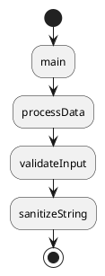
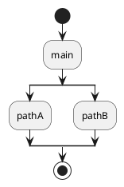

# Call Stack to PlantUML

[](https://marketplace.visualstudio.com/items?itemName=JianpingCai.call-stack-to-plantuml)
[](https://marketplace.visualstudio.com/items?itemName=JianpingCai.call-stack-to-plantuml)
[](LICENSE)

A Visual Studio Code extension that captures call stacks from debug sessions and converts them into PlantUML Activity Diagrams, helping you visualize and document complex execution flows.

## 🎯 Features

### Core Capabilities

- **📸 Capture Call Stacks**: Extract call stack information from any active debug session
- **🎨 Generate PlantUML Diagrams**: Automatically convert call stacks into PlantUML Activity Diagram syntax
- **🌳 Multi-Path Support**: Record multiple call stack paths and intelligently merge them into a tree structure
- **📋 Clipboard Integration**: Copy generated PlantUML scripts directly to your clipboard
- **🔧 Configurable**: Customize diagram line length for optimal readability
- **🧵 Thread Selection**: Choose which thread to capture when debugging multi-threaded applications

### Benefits

- **Visual Documentation**: Transform abstract call stacks into clear, visual diagrams
- **Debugging Aid**: Better understand complex execution flows during debugging
- **Code Review**: Share execution paths with team members using standardized UML
- **Architecture Analysis**: Document and analyze actual program behavior

## 📦 Installation

### From VS Code Marketplace

1. Open VS Code
2. Go to Extensions (`Ctrl+Shift+X` / `Cmd+Shift+X`)
3. Search for "Call Stack to PlantUML"
4. Click **Install**

### From Command Line

```bash
code --install-extension JianpingCai.call-stack-to-plantuml
```

### Manual Installation

1. Download the `.vsix` file from [GitHub Releases](https://github.com/JianpingCAI/call-stack-to-plantuml/releases)
2. In VS Code, go to Extensions view
3. Click the `...` menu → **Install from VSIX...**
4. Select the downloaded file

## 🚀 Usage

### Quick Start

1. **Start Debugging**: Open your project and start a debug session (`F5`)
2. **Hit a Breakpoint**: Pause execution at a breakpoint
3. **Open Command Palette**: Press `Ctrl+Shift+P` (Windows/Linux) or `Cmd+Shift+P` (Mac)
4. **Run Command**: Type and select **"Copy Call Stack to PlantUML"**
5. **Select Thread**: Choose the thread you want to capture from the dropdown
6. **Paste & Visualize**: Paste the copied PlantUML script into a PlantUML editor

### Available Commands

| Command | Description | Use Case |
|---------|-------------|----------|
| **Copy Call Stack to PlantUML** | Records current call stack and copies PlantUML script to clipboard | Quick one-shot capture and export |
| **Record Call Stack** | Records and merges current call stack into the tree without copying | Building complex multi-path diagrams |
| **Clear Recorded Call Stack** | Resets all recorded call stacks | Starting fresh or debugging new scenario |

### Advanced Workflow: Multi-Path Diagrams

For applications with multiple execution paths (e.g., conditional branches, callbacks):

1. **Record First Path**:
   - Hit first breakpoint
   - Run **"Record Call Stack"**
   
2. **Record Additional Paths**:
   - Continue execution (`F5`)
   - Hit another breakpoint (different path)
   - Run **"Record Call Stack"** again
   - Repeat for all paths you want to capture

3. **Generate Diagram**:
   - Run **"Copy Call Stack to PlantUML"**
   - The extension merges all paths into a unified diagram

4. **Clear When Done**:
   - Run **"Clear Recorded Call Stack"** to reset for next session

### PlantUML Visualization

Once you've copied the PlantUML script, visualize it using:

#### Online Editors
- [PlantUML Web Server](http://www.plantuml.com/plantuml/uml/)
- [PlantText](https://www.planttext.com/)

#### VS Code Extensions
- [PlantUML](https://marketplace.visualstudio.com/items?itemName=jebbs.plantuml) by jebbs
- [Markdown Preview Enhanced](https://marketplace.visualstudio.com/items?itemName=shd101wyy.markdown-preview-enhanced)

#### Local Rendering
```bash
# Install PlantUML locally
brew install plantuml  # macOS
# or download from https://plantuml.com/download

# Generate diagram
plantuml diagram.puml
```

## ⚙️ Configuration

### Settings

Configure the extension in your VS Code `settings.json`:

```json
{
  "call-stack-to-plantuml.maxLength": 60
}
```

| Setting | Type | Default | Description |
|---------|------|---------|-------------|
| `call-stack-to-plantuml.maxLength` | `number` | `60` | Maximum line length for function names in diagrams before word wrapping is applied |

### Accessing Settings

1. **Via UI**: 
   - Open Settings (`Ctrl+,` / `Cmd+,`)
   - Search for "call-stack-to-plantuml"
   
2. **Via settings.json**:
   - Open Command Palette
   - Type "Preferences: Open User Settings (JSON)"
   - Add the configuration

### Example Configurations

**Compact Diagrams** (for wide displays):
```json
{
  "call-stack-to-plantuml.maxLength": 100
}
```

**Narrow Diagrams** (for documentation):
```json
{
  "call-stack-to-plantuml.maxLength": 40
}
```

## 📖 Examples

### Example Output

**Captured Call Stack:**
```
main() → processData() → validateInput() → sanitizeString()
```

**Generated PlantUML:**


### Multi-Path Example

**Scenario**: Application with conditional logic

```typescript
function main() {
  if (condition) {
    pathA();
  } else {
    pathB();
  }
}
```

**Recording Process**:
1. Set breakpoint in `pathA()` → Record
2. Set breakpoint in `pathB()` → Record
3. Copy to PlantUML

**Generated Diagram** shows split execution paths:


## 🎓 Use Cases

### 1. Debugging Complex Logic
Visualize the actual execution flow through complex nested function calls.

### 2. Code Documentation
Generate diagrams for documentation that accurately reflect runtime behavior.

### 3. Performance Analysis
Identify call stack depth and redundant function calls.

### 4. Code Review
Share execution paths with team members for better code understanding.

### 5. Learning & Teaching
Help developers understand program flow in unfamiliar codebases.

## 🔍 Supported Debuggers

This extension works with any VS Code debugger that implements the Debug Adapter Protocol (DAP), including:

- **JavaScript/TypeScript**: Node.js, Chrome DevTools
- **Python**: Python Debugger
- **C/C++**: GDB, LLDB
- **Java**: Java Debug Server
- **Go**: Delve
- **C#**: .NET Debugger
- And many more...

## 🛠️ Troubleshooting

### Common Issues

**No threads available**
- Ensure your debug session is active and paused at a breakpoint
- Some debuggers may not support thread enumeration

**Call stack not captured**
- Verify you've selected a thread from the dropdown
- Check that the debugger supports stack trace requests

**Generated diagram looks wrong**
- Try adjusting the `maxLength` configuration
- Ensure the PlantUML syntax is valid in your editor

**Extension not activating**
- Check VS Code version compatibility (requires `^1.76.0`)
- Reload VS Code window (`Developer: Reload Window`)

### Getting Help

1. Check existing [GitHub Issues](https://github.com/JianpingCAI/call-stack-to-plantuml/issues)
2. Create a new issue with:
   - VS Code version
   - Extension version
   - Debugger being used
   - Steps to reproduce the problem

## 🤝 Contributing

Contributions are welcome! Please see [CONTRIBUTING.md](CONTRIBUTING.md) for guidelines.

### Quick Contribution Guide

1. Fork the repository
2. Create a feature branch: `git checkout -b feature/my-feature`
3. Make your changes
4. Add tests if applicable
5. Commit with clear messages: `git commit -m "Add: feature description"`
6. Push to your fork: `git push origin feature/my-feature`
7. Open a Pull Request

## 📄 License

This project is licensed under the MIT License. See the [LICENSE](LICENSE) file for details.

## 📝 Changelog

See [CHANGELOG.md](CHANGELOG.md) for version history and release notes.

## 🙏 Acknowledgments

- **VS Code Team** - For the excellent extensibility API and debug protocol
- **PlantUML** - For providing a powerful, text-based diagramming language
- **Contributors** - Thank you to everyone who has contributed to this project

## 📚 Resources

- [VS Code Extension API](https://code.visualstudio.com/api)
- [Debug Adapter Protocol](https://microsoft.github.io/debug-adapter-protocol/)
- [PlantUML Documentation](https://plantuml.com/)
- [PlantUML Activity Diagrams](https://plantuml.com/activity-diagram-beta)

## 💡 Tips & Best Practices

1. **Clear between sessions**: Reset the call stack tree when switching to different debugging scenarios
2. **Use meaningful breakpoints**: Place breakpoints at key decision points for better diagrams
3. **Adjust maxLength**: Experiment with different values to find what works best for your code style
4. **Combine with PlantUML extensions**: Install a PlantUML viewer in VS Code for seamless workflow

---

**Enjoy visualizing your code execution flows!** ⭐

If you find this extension helpful, please consider:
- ⭐ [Starring the repository](https://github.com/JianpingCAI/call-stack-to-plantuml)
- 📝 [Writing a review](https://marketplace.visualstudio.com/items?itemName=JianpingCai.call-stack-to-plantuml&ssr=false#review-details)
- 🐛 [Reporting issues](https://github.com/JianpingCAI/call-stack-to-plantuml/issues)
- 🤝 [Contributing](CONTRIBUTING.md)
